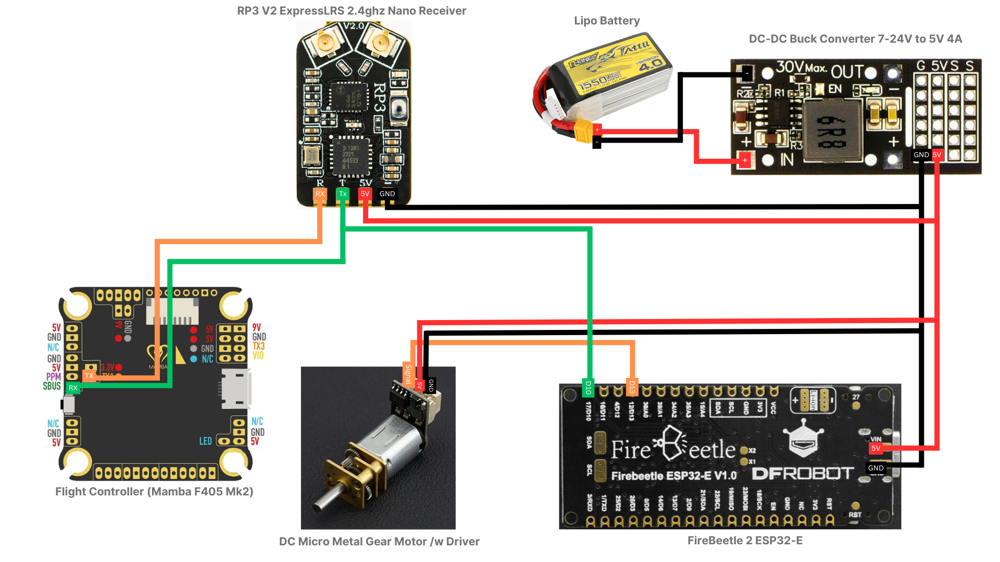

# CRSF Protocol Channel Decoder for ELRS Receivers Using ESP32

A project showcasing how to decode data from an ExpressLRS (ELRS) receiver using the CRSF protocol, leveraging an ESP32 to extract all RC channel values. This serves as a foundation for advanced RC applications, including autonomous control and hardware integration.

## Features
- Decode Crossfire (CRSF) protocol packets from ELRS receivers.
- Extract all 16 RC channel values in real-time.
- Easily integrate with various applications, from servo motor control to custom robotics.

## Use Case
This decoder was used to transform an ordinary FPV drone into a delivery drone by mapping specific channel values to control payload mechanisms. See the [Use Case Documentation](docs/use_case.md) for more details.


You can find a **detailed tutorial** on replicating the drone project [here](https://www.instructables.com/Turn-Any-Drone-Into-a-Delivery-Drone/).📦

## Theory
ELRS transmits RC data using the Crossfire (CRSF) protocol. This project decodes the protocol's structure to access channel values. See the [Theory Documentation](docs/theory.md) for an in-depth explanation.

## Hardware Requirements
- ESP32
- ELRS Receiver
- Breadboard and connecting wires

## Wiring Diagram


## Quickstart
1. Clone this repository:
   ```bash
   git clone https://github.com/yourusername/elrs-channel-decoder.git


