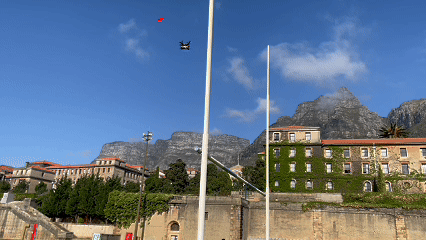

# Use Case: Turning an FPV Drone into a Delivery Drone

## Overview
By decoding ELRS channel values, you can map RC controls to custom mechanisms. This use case demonstrates how an ordinary FPV drone was transformed into a delivery drone.

### Components
1. **ESP32:**
   - Decodes ELRS channel values to map controls.
2. **Servo Motor:**
   - Activated to release payloads.
3. **FPV Drone:**
   - Serves as the delivery platform.

### Workflow
1. **Channel Mapping:**
   - Channel 7 was used to activate the payload release mechanism.
2. **Payload Release Mechanism:**
   - A servo motor attached to the drone was programmed to rotate when Channel 7's value exceeded 1000.
3. **Result:**
   - The drone successfully delivered lightweight packages using manual channel control.

### Future Applications
- Autonomous payload delivery based on GPS waypoints.
- Integration with telemetry feedback for precise drop zones.
